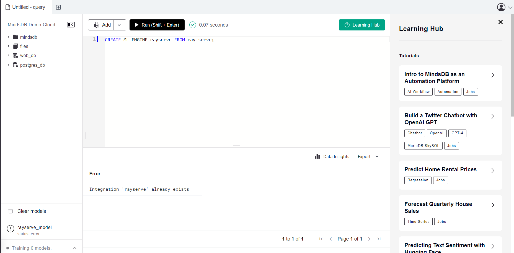
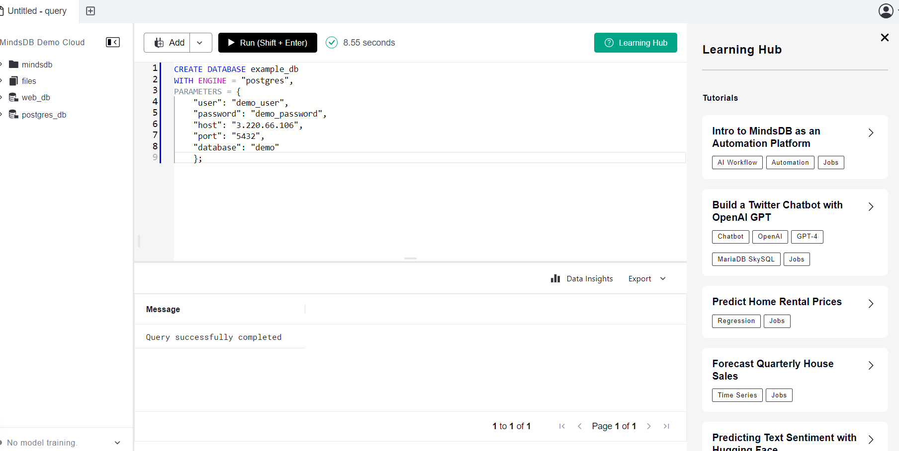
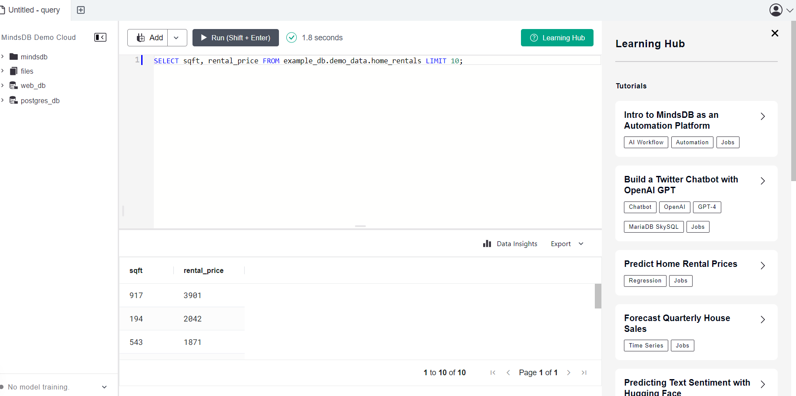
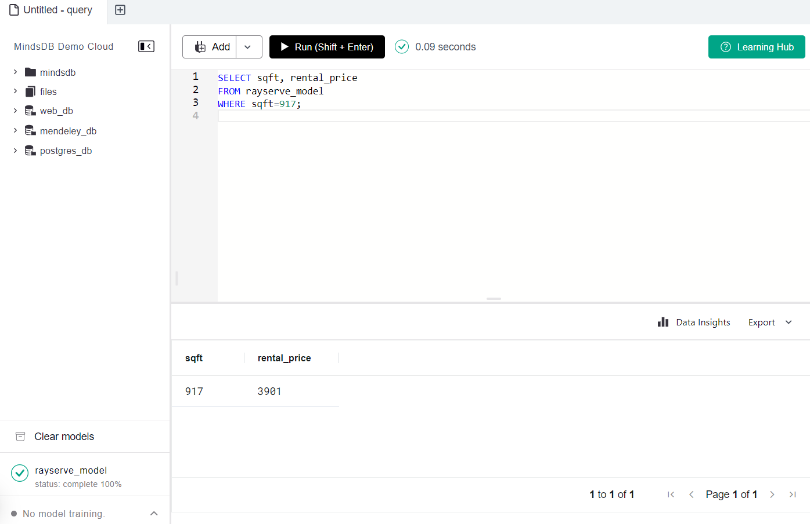

# Testing Ray Serve Integration

This README provides instructions for testing the Ray Serve integration in MindsDB.

For more details, refer to the related [GitHub Issue](https://github.com/mindsdb/mindsdb/issues/8007).

## Test Cases MindsDB Ray serve ML

**Description:**
### 1. This creates  the engine:. 

```
CREATE ML_ENGINE rayserve FROM ray_serve;    

```
**Screeshot Result: Query successfull**



-----
```
CREATE DATABASE example_db
WITH ENGINE = "postgres",
PARAMETERS = {
    "user": "demo_user",
    "password": "demo_password",
    "host": "3.220.66.106",
    "port": "5432",
    "database": "demo"
    }; 

```
**Screeshot Result: Query successfull**



-----

### 3. Query3

```
SELECT sqft, rental_price FROM example_db.demo_data.home_rentals LIMIT 10;
   

```
**Screeshot Result: Query Passed**



-----
### 4. you can the following command to create the model inside MindsDB by triggering the train endpoint:

```
CREATE MODEL mindsdb.rayserve_model
FROM integration_name (SELECT * FROM table_name)
PREDICT target
USING 
engine='ray_serve',
train_url='http://ray_serve_url:port/my_model/train',
predict_url='http://ray_serve_url:port/my_model/predict';
   

```
**Screeshot Result: Query Passed**


-----


### 5. you can use this to query

```
SELECT input_col, target_col
FROM rayserve_model
WHERE input_col=some_value; -- could also use a JOIN here, as usual

DESCRIBE rayserve_model;

```
**Screeshot Result: Query passed**



-----


## Result
The Ray serve integration has been  tested, all test passed.
